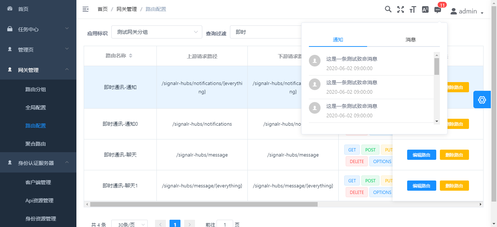

# Abp FreeTime
一个整合了abp vnext基础服务的快速开发项目
前端采用vue单页面程序

######  1、为什么要做此项目？

​		abp vnext确实是.net下一个很好的开发框架，但官方对免费版的支持不够友好，一定程度上影响了abp vnext的发展。收费版的价格虽然不算太高，但对于我等草根来说，还是有够肉疼的，一直想为abp vnext的免费生态做点贡献，于是就有了此项目。

###### 2、不是所有的项目都应该是微服务项目的

​		得益于.net core的云原生开发，abp vnext的模块化构架，开发微服务的项目轻松了很多。但不是所有项目都必须是微服务的。于是一直想整一个常用功能齐全、高效开发、操作界面美观的单体项目，来弥补当下凡项目必未服务的弊病。

###### 3、功能介绍

​		用户管理，角色管理，权限管理，租户管理，组织机构管理，Notification，IdentityServer

###### 4、申明

​		说明一下，本系统，我并非原创（代码），我只是个代码搬运工。源代码出自： [colinin/abp-vue-admin-element-typescript: vue admin with abp (github.com)](https://github.com/colinin/abp-vue-admin-element-typescript) ，作者的原项目是微服务构架的，这也是我觉得很赞的一个abp vnext开发项目，如您需要微服务构架，请点击链接直接跳过去！

附一张图吧，这样您对本项目会有一个更快速，更直观的了解：

